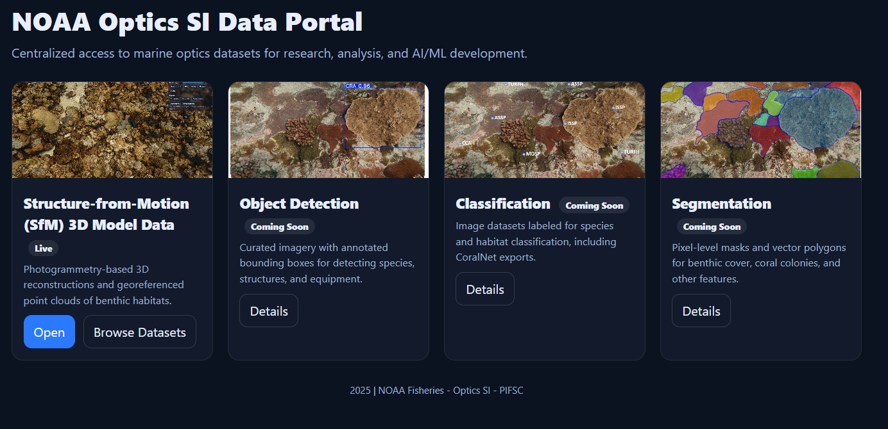

# NOAA Optics Data Portal

The **[Optics Data Portal Link](https://michaelakridge-noaa.github.io/optics-data-portal/)** is a public-facing entry point for browsing, previewing, and downloading NOAA datasets.  

## Dataset Categories
| Category | Description | Example Content |
|----------|-------------|-----------------|
| **SfM 3D Models** (`sfm/`) | Structure-from-Motion (SfM) photogrammetry point clouds, viewable in-browser with Potree. | Coral reef site 3D models |
| **Object Detection** (`odj/`) | Labeled imagery with bounding box annotations for detection model training. | Fish detection datasets |
| **Classification** (`class/`) | Image classification datasets, including CoralNet exports and labeled taxonomy datasets. | Coral bleaching classification |
| **Segmentation** (`seg/`) | Semantic or instance segmentation datasets with polygon/mask annotations. | Coral segmentation masks |

## Features
- **Interactive 3D Point Cloud Viewer**  
  Powered by [Potree](https://github.com/potree/potree), optimized for quick initial loading and detailed exploration.
- **Category Landing Pages**  
  Each dataset type has its own landing page with thumbnails, dataset descriptions, and open/view buttons.
- **Dataset Thumbnails**  
  Live datasets show actual thumbnails (e.g., from GCP), while upcoming datasets show placeholder icons.
- **Responsive Design**  
  Works on desktop, tablet, and mobile.

----------
#### Disclaimer
This repository is a scientific product and is not official communication of the National Oceanic and Atmospheric Administration, or the United States Department of Commerce. All NOAA GitHub project content is provided on an ‘as is’ basis and the user assumes responsibility for its use. Any claims against the Department of Commerce or Department of Commerce bureaus stemming from the use of this GitHub project will be governed by all applicable Federal law. Any reference to specific commercial products, processes, or services by service mark, trademark, manufacturer, or otherwise, does not constitute or imply their endorsement, recommendation or favoring by the Department of Commerce. The Department of Commerce seal and logo, or the seal and logo of a DOC bureau, shall not be used in any manner to imply endorsement of any commercial product or activity by DOC or the United States Government.

#### License
- Details in the [LICENSE.md](./LICENSE.md) file.
